# Method
Method is a digital consultancy that integrates business, brand, product, and data strategy with visual, interaction, and service design, alongside full stack technical implementation services, to collaboratively craft digital solutions from inception through to execution. During Method's Residency, I was able to work with Product Designers, Product Managers, & Stakeholders to create a gamified Quiz plugin application. Production occured over a 8 week time span that contained learning a new tech stack, scaffolding the backend, and developing the final MVP. 

## Gamehive 

For this project and the sake of respecting the properiaty aspect of the product, I am pulling on a interest that one stakeholder expressed in a realtime quiz application. Gamehive is a minimum viable product (MVP) in which a testMaker can create & distibute a realitime Quiz to testTakers. This repository contains Next.Js, Typescript, React, Tailwind CSS, Chart js and Firestore.

Per the user studies, users expressed an interest in anonymity from peers and those in upper managment as well as stakeholders expressing the need for a mobile friendly design. These features are implemented utilizing Tailwind CSS Mobile first design as well as allowing the use for setting user_name per the discretion of the testTaker. Currently a work in progress, much like in the residency, I focused on the front end and creating one complete user flow and having data being stored through React's useContext to globalize the states. The testMaker user flow allows for the creation of the quiz through quiz cards which displays in the Game portion of the quiz application. Whereas the testTaker will be able to insert game access code and set their user name. Bother testTaker and testMaker will see their lobbies populate with users logged in and await for the testMaker to intiated the game. testTakers will receive the questions with ability to select an answer within a 30 second time frame. At the end of the game both testTaker and testMaker will see a leadership board.

Next Steps: 

-Connecting the backend to the front end.

-Apply Designs and establish theme.

-Apply Responsive design through breakpoints.

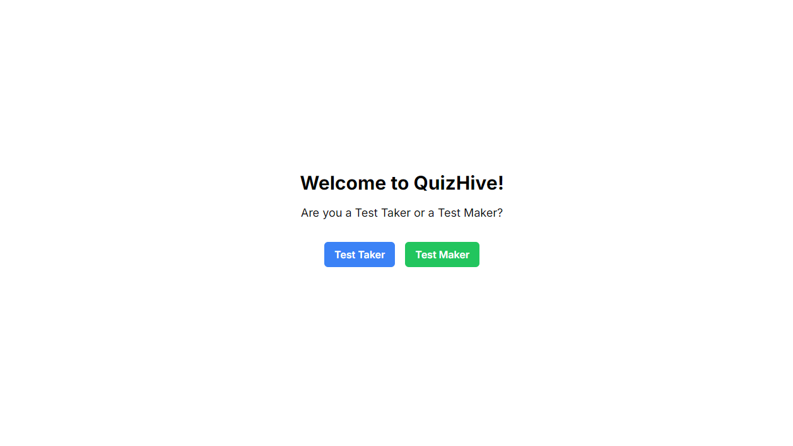

🧑‍🏫TestMaker Flow
#

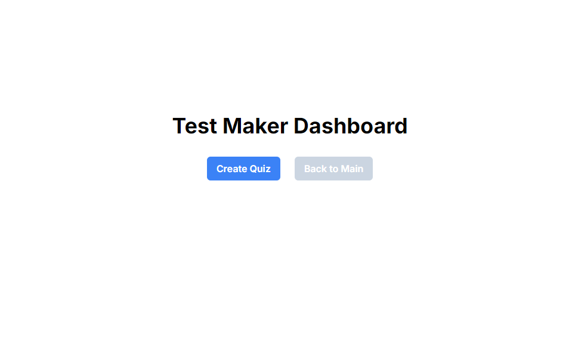
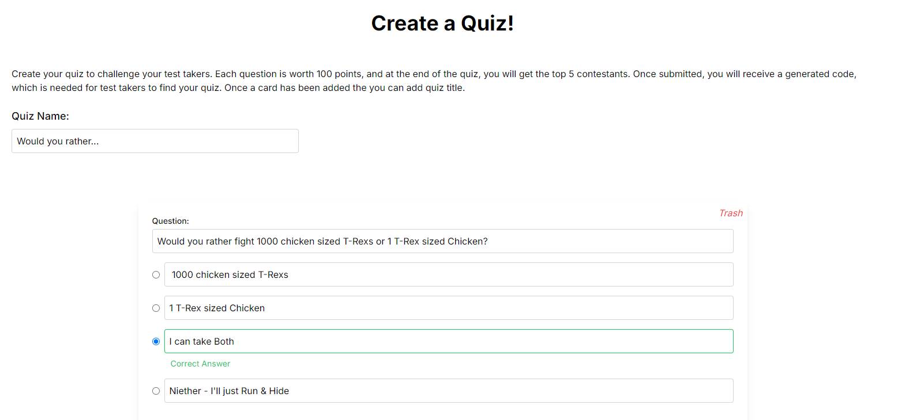
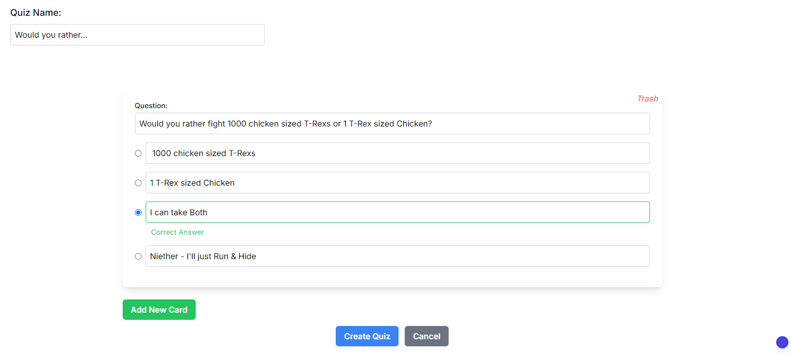
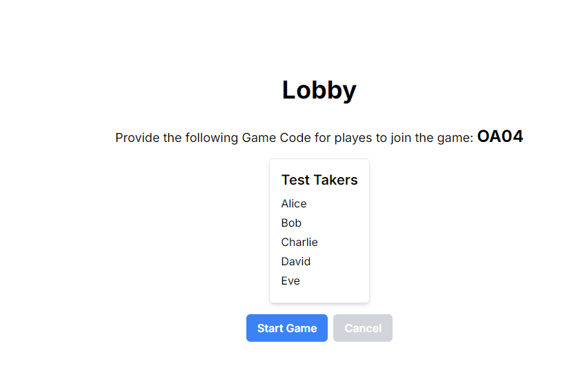
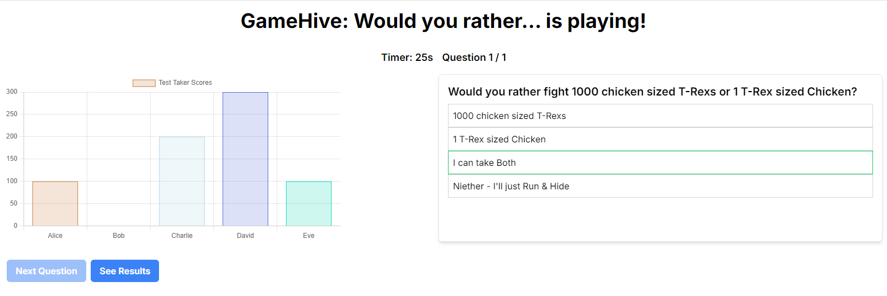
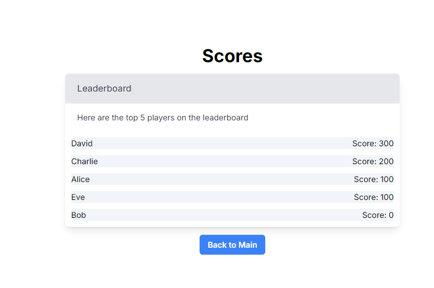

👨‍🎓 TestTaker Flow
#

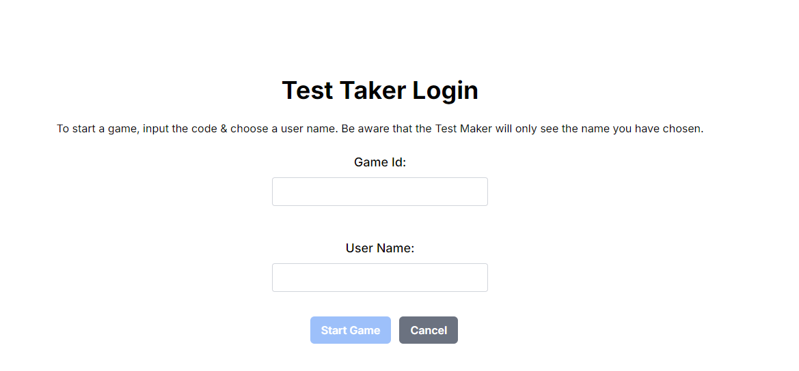
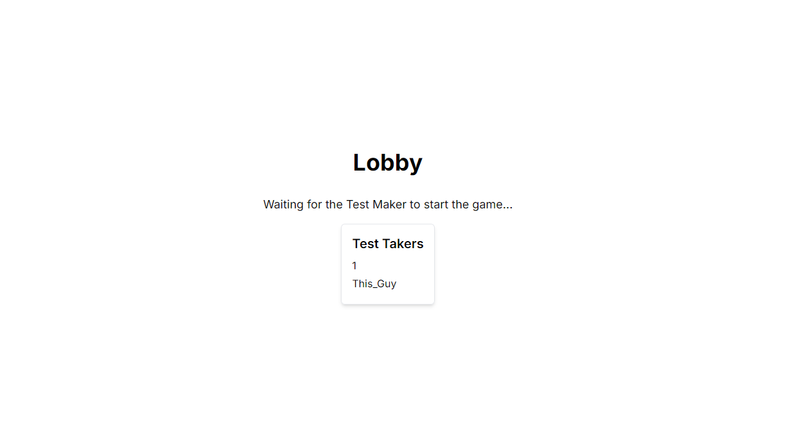
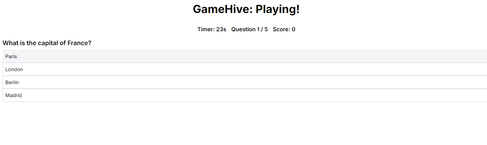
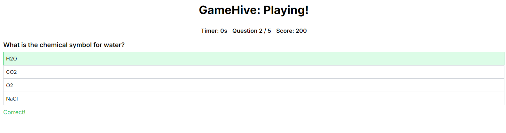

